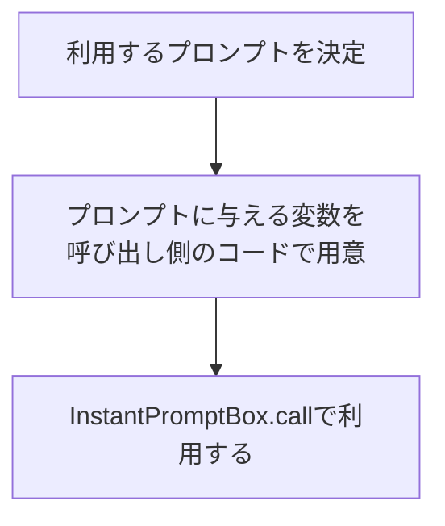

# InstantPromptBox project

## flow



## directory structure

```
InstantPromptBox
├── instant_prompt_box
│   ├── examples
│   │   └── example01.py
│   ├── prompts
│   │   ├── other_oss #プロンプトが由来するOSS毎にディレクトリを構成
│   │   └── zoltraak
│   │       ├── zoltraak.py
│   │       ├── zoltraak_prompt_fix_code.md
│   │       ├── zoltraak_prompt_fix_code_smart.md
│   │       └── LICENSE # OSS毎のライセンス情報
│   ├── src
│   │   ├── main.py # プロンプトの処理を行うコード(全promptsを読み込む処理、promptを指定して変数展開する処理)
│   │   └── utils
│   │       └── file_util.py # ファイル操作を行うユーティリティ
│   └── test
│       ├── __init__.py
│       └── test_main.py
└── pyproject.toml
```

### sample

```python
fix_code_prompt = InstantPromptBox.zoltraak.zoltraak_prompt_fix_code(code=code, error_message=error_message)
```

## other

ユーティリティクラスは@staticmethod で実装する。
