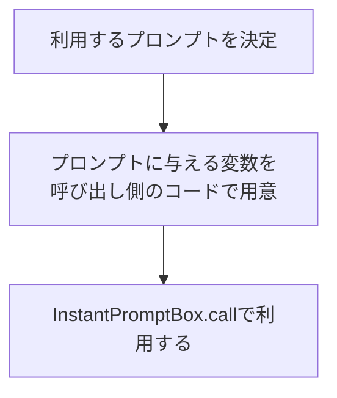

# InstantPromptBox プロジェクトの全体像

## 処理の流れ



## ディレクトリ構成

```
InstantPromptBox
├── prompts
│   ├── zoltraak #プロンプトが由来するOSS毎にディレクトリを構成
│   │   ├── zoltraak_prompt_aaaa.md
│   │   ├── zoltraak_prompt_bbbb.md
│   │   ├── zoltraak_pre_process.py
│   │   └── LICENSE # OSS毎のライセンス情報
│   └── other_oss
│       ├── ・・・
│       └── LICENSE
├── src
│   ├── instant_prompt_box.py # プロンプトの処理を行うコード(全promptsを読み込む処理、promptを指定して変数展開する処理)
│   ├── utils
│   |    └── file_util.py # ファイル操作を行うユーティリティ
└── examples # プロンプトの利用例
    └── example01.py
```

### ユーザ要求記述書(例)

作成中

### 要件定義書(例)

requirements/zoltraak_pre_process.md

### ターゲットファイル作成用コード(例)

generated/requirements/zoltraak_pre_process.py

複数のターゲットファイルを順次作成するための python ファイル

### ターゲットファイル(例)

generated/zoltraak_pre_process/README.md
generated/zoltraak_pre_process/pre_process.py

要件定義書により最終的に出力されたファイル群

## その他

ユーティリティクラスは@staticmethod で実装する。
